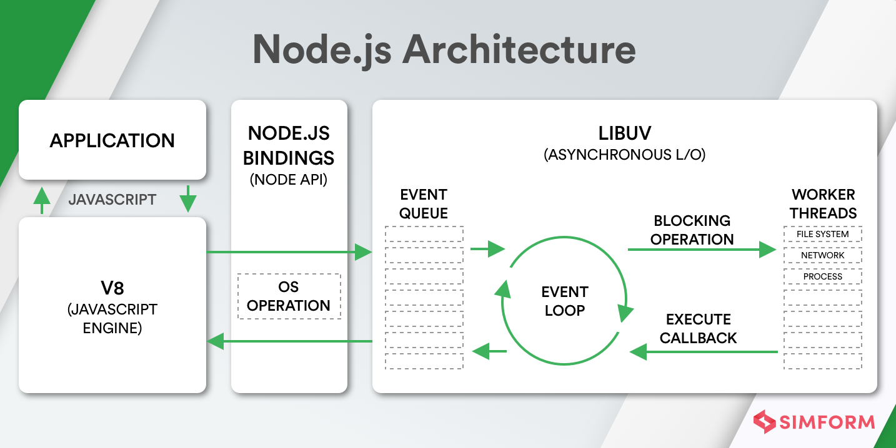

  # Table Of Content

  - [Introduction](#introduction)
  - [Architecture](#architecture)
  - [Core Modules](#core-modules)
    - [OS](#os)
    - [fs](#fs)
    - [events](#events)
    - [http](#http)
  - [Getting Started](#getting-started)

1) ## **Introduction**
    
   NodeJS is **non blocking asynchronous javascript runtime environment** which work on single thread and can be very efficient for I/O extensive task.
    
   ### **Things to Remember**
   
   - Node is a runtime environment for executing JS code.
   
   - Essentially, Node is a C++ program that embeds Chrome’s v8 engine, the fastest JS engine in the world.
   
   - We use Node to build fast and scalable networking applications. It’s a perfect choice for building RESTful services.
   
   - Node applications are single-threaded. That means a single thread is used to serve all clients.
   
   - Node applications are asynchronous or non-blocking by default. That means when the application involves I/O operations (eg accessing the file system or the network), the thread doesn’t wait (or block) for the result of the operation. It is released to serve other clients.
   
   - This architecture makes Node ideal for building I/O-intensive applications.
   
   - In Node, we don’t have browser environment objects such as window or the document object. Instead, we have other objects that are not available in browsers, such as objects for working with the file system, network, operating system, etc.

   visit [NodeJS](https://nodejs.org/en/) for more information
  
        NOTE - You should avoid using Node for CPU-intensive applications, such as a video encoding service. Because while executing these perations, other clients have to wait for the single thread to finish its job and be ready to serve them.
  
   
2) ## **Architecture**
    
3) ## **Most Used Core Modules**
   - ### OS
   - ### File System
   - ### Events
   - ### Http
   - ### Path
   - ### Process
   - ### Query Strings
   - ### Stream
  

4) ## **Getting Started**

